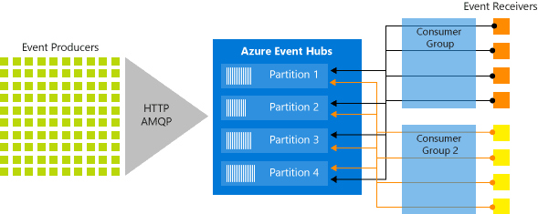
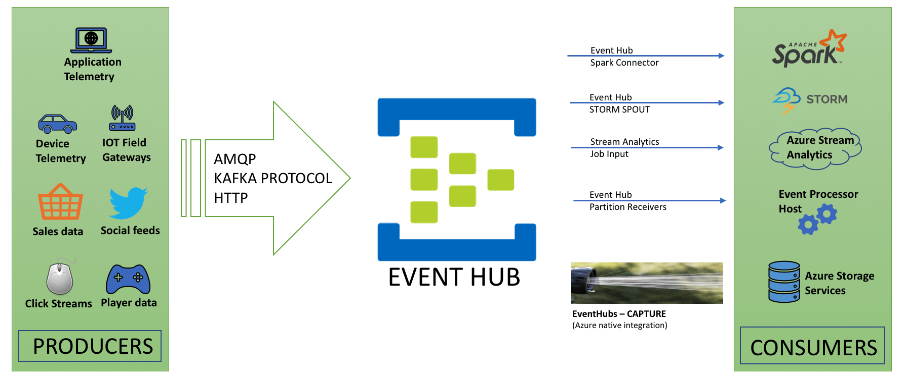

## Azure Event Hubs: Overview

Azure Event Hubs is a fully managed, real-time data ingestion service that allows you to capture and process large volumes of event data, such as telemetry and log data, in a scalable, secure, and reliable manner. It is designed to handle millions of events per second and can integrate seamlessly with various Azure services for processing and analyzing the ingested data.

## Azure Event Hub Architeture:

## Azure Event Hub Data Flow:

### Why Azure Event Hubs is Used

- **High Throughput:** Event Hubs can ingest and process millions of events per second, making it ideal for applications that generate large volumes of data, such as IoT, logging, and telemetry systems.
- **Real-time Processing:** Event Hubs enables real-time processing of streaming data, allowing businesses to react to data as it arrives.
- **Scalability:** It is highly scalable and can easily adjust to varying data loads, ensuring that your system remains responsive even under heavy traffic.
- **Integration:** Event Hubs integrates with a wide range of Azure services, such as Azure Stream Analytics, Azure Functions, and Azure Data Lake Storage, enabling a complete end-to-end solution for data processing and analytics.
- **Durability:** It offers data retention capabilities, allowing events to be retained for a specified period, ensuring that no data is lost even if consumers are temporarily offline.

### Key Components of Azure Event Hubs

1. **Event Producers:**
   - These are the entities that send event data to the Event Hub. Producers can be applications, devices, or any other source of telemetry data.
   - Event producers communicate with Event Hubs using the AMQP 1.0 or HTTPS protocols.

2. **Event Hubs:**
   - The core component of the service where the data is ingested. It is a container for events, similar to a topic in a messaging system.
   - Each Event Hub can have multiple partitions, which allow for parallel processing and high throughput.

3. **Partitions:**
   - Partitions are used to distribute the load across multiple consumers. Each partition acts as an independent queue, and the events within a partition are ordered.
   - Partitions enable scalable parallelism, allowing multiple consumers to process different partitions simultaneously.

4. **Consumer Groups:**
   - A consumer group is a view (state, position, or offset) of an entire Event Hub. It enables multiple consumers to have their own independent view of the event stream.
   - Each consumer group can read the event data independently from other consumer groups.

5. **Capture:**
   - Event Hubs Capture allows you to automatically capture streaming data and store it in Azure Blob Storage or Azure Data Lake Storage for long-term retention and batch processing.

### Applications of Azure Event Hubs

- **IoT Telemetry:**
  - Collect and process data from thousands of IoT devices in real-time, such as temperature sensors, smart meters, and industrial equipment.
  
- **Application Logging:**
  - Centralize logs from distributed applications and services, making it easier to monitor, troubleshoot, and analyze application performance.
  
- **Live Dashboarding:**
  - Power real-time dashboards that visualize data such as website analytics, social media streams, or financial market data.
  
- **Fraud Detection:**
  - Stream financial transactions in real-time to detect fraudulent activities using machine learning models.
  
- **Stream Processing:**
  - Integrate with services like Azure Stream Analytics to perform real-time analytics on streaming data, such as filtering, aggregating, or joining streams.

### Use Cases in Real Industry

1. **Smart Manufacturing:**
   - In a manufacturing setup, Azure Event Hubs can be used to ingest telemetry data from various machines and sensors on the production floor. This data can then be analyzed in real-time to monitor equipment health, predict failures, and optimize production efficiency.

2. **Financial Services:**
   - Banks and financial institutions use Event Hubs to ingest and analyze transaction data in real-time. This allows them to detect fraudulent activities, monitor trading activities, and comply with regulatory requirements.

3. **Retail Analytics:**
   - Retail companies leverage Event Hubs to collect data from online transactions, in-store sensors, and customer interactions. This data is used to analyze buying patterns, personalize marketing campaigns, and optimize inventory management.

4. **Connected Vehicles:**
   - Automotive companies use Event Hubs to ingest telemetry data from connected vehicles. This data includes vehicle health, driver behavior, and GPS coordinates, which can be analyzed to provide real-time updates to drivers, predictive maintenance alerts, and fleet management insights.

5. **Telecommunications:**
   - Telecom providers use Event Hubs to collect and process call data records, network performance metrics, and customer usage patterns in real-time. This data is crucial for optimizing network performance, detecting service outages, and offering personalized customer services.

### Conclusion

Azure Event Hubs is a powerful and versatile service for handling large-scale event data in real-time. Its ability to ingest, process, and integrate with other Azure services makes it an essential tool for industries looking to harness the power of streaming data for real-time analytics, monitoring, and decision-making.
